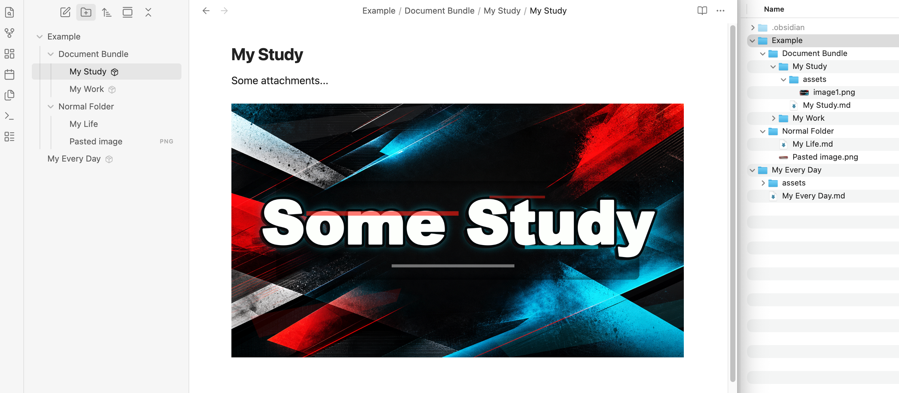

# Documents Bundle

[English](README.md) | 简体中文

给 Obsidian 一个接近 Notion 的附件体验，同时保留 Markdown 和本地文件的自由。

在 Notion 里，你粘贴一张图片、拖进一个 PDF，它就自然属于当前页面。你不用关心附件目录，不用手动整理文件，也不用过几天再回头找“那张截图到底去哪了”。

Documents Bundle 想把这种低心智负担的体验带到 Obsidian：每篇 Markdown 笔记都可以变成一个自包含的文档包。

```text
Project Brief/
  Project Brief.md
  assets/        # 没有附件时可以不存在
```

粘贴图片、拖入 PDF、迁移旧的本地附件链接，文件都会落到这篇笔记自己的 `assets/` 文件夹里。用起来像“附件属于当前页面”，底层仍然是普通文件，便携、透明、不锁定。

## 截图



## 它能做什么

- 从 Obsidian 原生文件菜单创建文档包。
- 把已有 Markdown 文件转换成文档包。
- 将当前文档包里的粘贴和拖入文件保存到 `assets/` 文件夹。
- 自动插入类似 `./assets/sketch.png` 的相对 Markdown 链接。
- 将旧的本地附件迁移进文档包，并重写笔记里的链接。
- 重命名文档包文件夹时，同步维护主 Markdown 文件名。
- 在 Obsidian 文件列表里标记文档包，让它看起来更像一个独立文档对象。

## 为什么需要它

Obsidian 的优势是普通文件，但附件管理经常会变成小麻烦。

Documents Bundle 适合那些“笔记和附件应该一起走”的场景：项目说明、研究资料、客户文档、写作草稿、课程笔记，或者任何带有截图、PDF、音频、图表的内容。

文档包的结构刻意保持简单：

```text
Document/
  Document.md
  assets/
    image.png
    brief.pdf
```

没有数据库，没有自定义归档格式，也没有锁定。即使禁用插件，它依然只是一个普通文件夹。只有 `Document.md` 的同名文件夹也已经是文档包；如果缺少 `assets/`，添加附件时会自动创建。

## 使用方式

### 创建文档包

在 Obsidian 的文件列表中，右键一个文件夹，选择 **New bundle document here**。

插件会创建一个未命名文档包。你可以直接在文件列表里重命名这个文件夹，Documents Bundle 会让主 Markdown 文件名保持同步。

```text
Project Brief/
  Project Brief.md
  assets/
```

### 转换已有笔记

在文件列表里右键一个 Markdown 文件，选择 **Convert to bundle**。

插件会先预览将要移动的本地附件并请求确认。确认后，它会把这篇笔记移动到同名文件夹里，创建 `assets/` 文件夹，将这些附件迁入文档包，并重写对应链接。

### 粘贴或拖入附件

当当前编辑器打开的是文档包主文档时，粘贴和拖入的文件会被保存到这个文档包自己的 `assets/` 文件夹里。

```markdown

[contract.pdf](./assets/contract.pdf)
```

普通笔记不会被接管。如果当前文件不是文档包主文档，粘贴和拖入行为会继续交给 Obsidian 自己处理。

### 迁移已有附件

右键一个文档包文件夹，选择 **Migrate attachments to bundle**。

Documents Bundle 会检查本地附件链接，把文件复制到 `assets/`，并把笔记里的链接改写成相对路径。被多个文档包共享的源文件会被复制而不是移动，避免一次整理悄悄弄断别的笔记。

## 设置

- **Handle pasted and dropped attachments in bundles**：将文档包里的粘贴和拖入文件保存到当前文档包的 `assets/` 文件夹。
- **Enhance native File Explorer**：在文件列表中标记文档包，视觉上隐藏内部主文档和 `assets/` 文件夹，并允许点击文档包标题打开主文档。
- **Bundle marker style**：选择文档包标记样式：不显示、小图标、加粗标题，或 `Bundle` 文字标记。

## 移动端支持

Documents Bundle 不是桌面端专属插件。核心文档包操作和附件处理使用 Obsidian vault API，可以在移动端工作。

打开系统文件管理器里的 `assets/` 文件夹是桌面端能力。在移动端，或任何没有系统文件浏览器 API 的环境中，插件会改为显示这个附件文件夹在 vault 中的路径。

## 限制

- 原生文件列表增强只是视觉增强，不会修改 Obsidian 核心文件，也不会改变你的 vault 结构。
- 文档包内部仍然是普通文件。其他插件、同步工具和文件管理器依然可以看到并编辑它们。
- 文件列表增强依赖 Obsidian 当前的文件列表 DOM 结构。如果 Obsidian 后续改动较大，可以先在设置中关闭 **Enhance native File Explorer**。
- 附件迁移只会重写它能安全解析到本地 vault 文件的链接。
